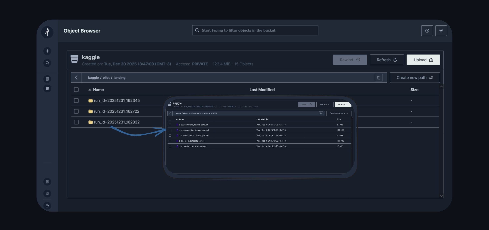
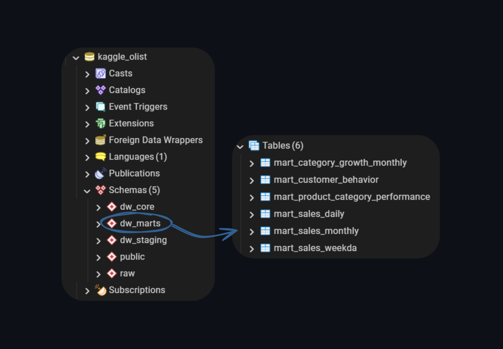
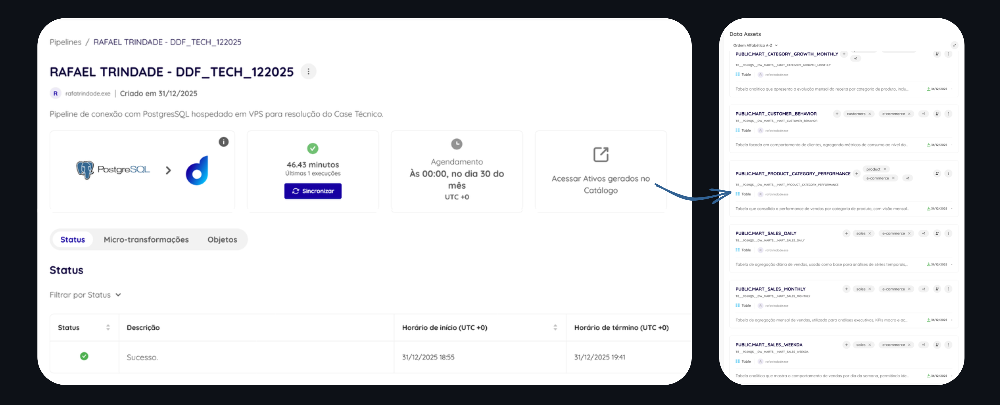
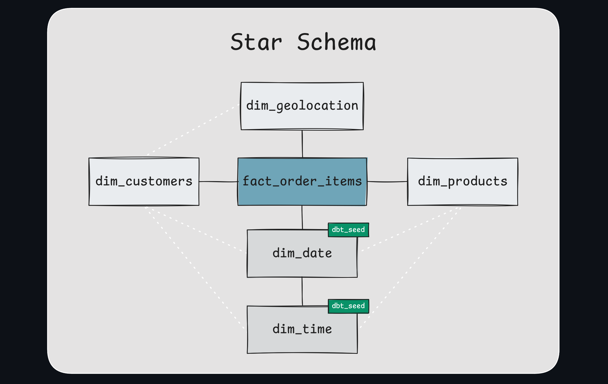
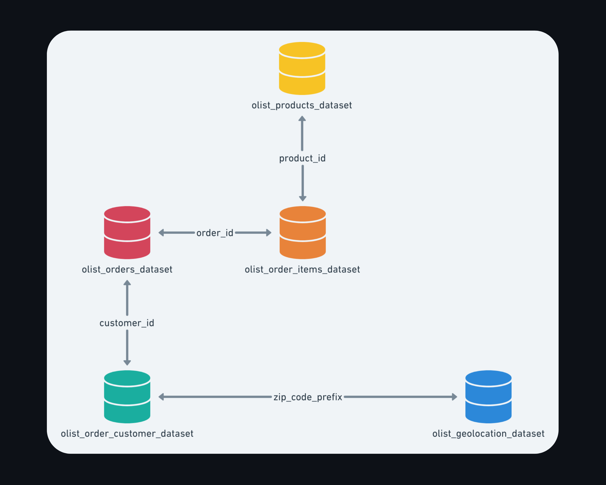
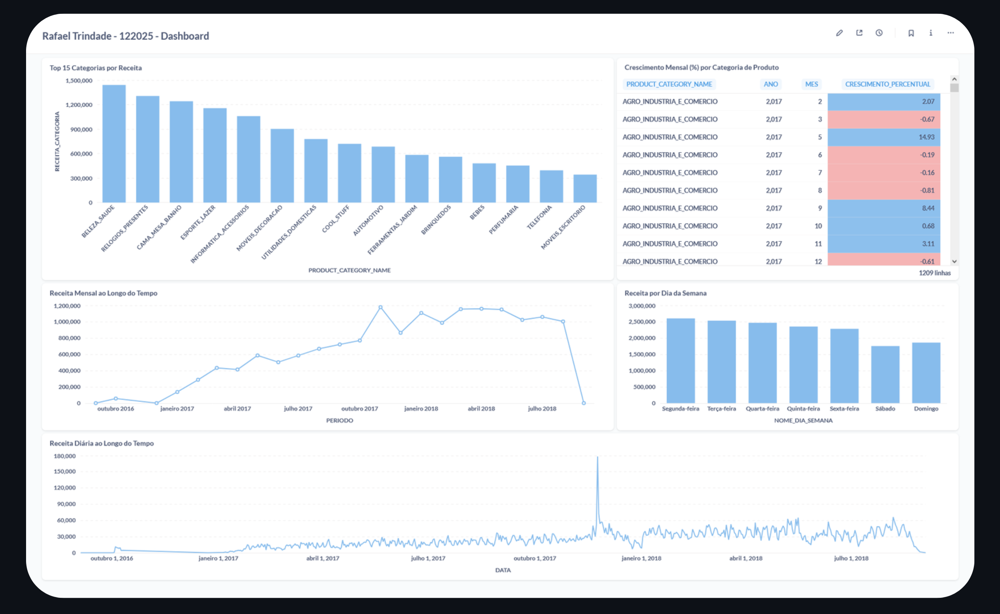
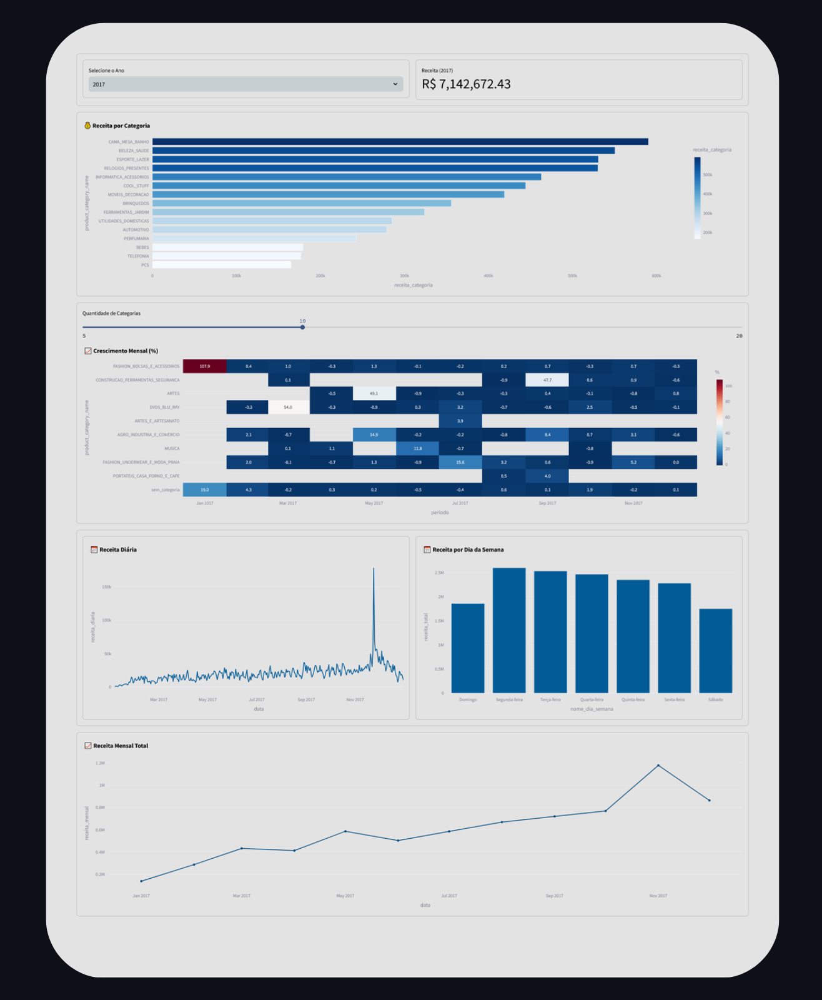

# RAFAEL TRINDADE - DDF_TECH_122025


> **Portfólio:** [https://rafa-trindade.github.io/](https://rafa-trindade.github.io/)<br>
> **LinkedIn:** [https://www.linkedin.com/in/rafatrindade/](https://www.linkedin.com/in/rafatrindade/)


## 📌 Introdução
Este repositório contém a resolução do Case Técnico para a posição Engenheiro de Dados Júnior na **Dadosfera**. O projeto foca em uma empresa de E-commerce, utilizando o dataset brasileiro da Olist (Kaggle) para construir uma plataforma de dados ponta a ponta, integrando engenharia moderna, modelagem dimensional e visualiação de dados.

## 🛠️ Arquitetura Geral da Solução - *Prova de Conceito (PoC)*
A arquitetura proposta segue padrões modernos de **Lakehouse** + **Data Warehouse Analítico**, combinando **MinIO**, **DuckDB**, **PostgreSQL**, **dbt**, **Pandera** e **Dadosfera**.

### Principais componentes:

- **Fonte de Dados:** Kaggle - Olist (CSV)
- **Data Lake:** MinIO - *Camada Landing* (com organização em Bronze, Silver e Gold)
- **Engine de Processamento:** DuckDB
- **Data Warehouse:** PostgreSQL (containerizado via Docker)
- **Transformações:** dbt
- **Qualidade de Dados:** Pandera + dbt tests
- **Visualizações e Catálogo de Dados:** Dadosfera + Metabase
- **Data App Analítico:** Streamlit


## 📚 Mapeamento da Documentação

### 🏗️ Data Architecture
📄 [`docs/data_architecture/`](docs/data_architecture/README.md)

Descreve a arquitetura técnica da **Prova de Conceito (PoC)** em execução:
- Visão geral da arquitetura **Lakehouse + Data Warehouse Analítico**
- Componentes da stack (Kaggle API, Python, MinIO, DuckDB, PostgreSQL, dbt, Pandera, Docker)
- Papéis e responsabilidades de cada serviço
- Integração entre ingestão, carga, modelagem analítica e consumo
- Execução do ambiente em **VPS**, priorizando simplicidade e portabilidade

---

### 🏛️ Data Governance
📄 [`docs/data_governance/`](docs/data_governance/README.md)

Centraliza as políticas e diretrizes do projeto e mapeia como a solução atende,
na prática, aos pilares de **Data Governance**:
- Política de retenção baseada em execuções técnicas (`run_id`)
- Definição de contratos gerais de dados
- Estratégias seguras de reprocessamento e rollback
- Governança aplicada via código e automação
- Suporte nativo à auditoria, observabilidade e controle operacional

---

### 🧬 Data Lineage
📄 [`docs/data_lineage/`](docs/data_lineage/README.md)

Documenta a rastreabilidade ponta a ponta dos dados:
- Origem dos dados (Kaggle → Data Lake)
- Fluxo técnico entre camadas:
  - Landing (MinIO)
  - Data Warehouse: Raw → Staging → Core → Marts
- Separação explícita entre transformações técnicas e semânticas
- Base para auditoria, impacto de mudanças e governança analítica

---

### 🔍 Data Observability
📄 [`docs/data_observability/`](docs/data_observability/README.md)

Mapeia como o projeto atende aos pilares clássicos de **Data Observability**:
- Freshness
- Volume
- Schema
- Distribution
- Lineage
- Quality
- Reliability e Reprocessamento

A observabilidade emerge como **resultado natural das decisões de arquitetura,
governança e qualidade de dados**, sem dependência de ferramentas externas.

---

### 📊 Data Profiling
📁 [`docs/data_profiling/landing_*`](docs/data_profiling/landing/)

Apresenta análises exploratórias e estatísticas dos dados na camada **Landing**,
com **um relatório de profiling por dataset**:
- Volumetria
- Cardinalidade
- Distribuição de valores
- Percentual de nulos

Utilizado como base para **Data Quality**, **Data Observability** e definição de contratos de dados.

---

### ✅ Data Quality
📄 [`docs/data_quality/`](docs/data_quality/README.md)

Descreve como a **qualidade de dados** é garantida ao longo de todo o pipeline:
- Validação de **schema e estrutura antes da persistência na camada Landing** com **Pandera**
- Contratos de dados explícitos por dataset
- Logs técnicos auditáveis por execução (`run_id`)
- Testes de integridade, unicidade e regras de negócio com **dbt tests**
- Separação clara entre:
  - Qualidade técnica (ingestão)
  - Qualidade semântica e analítica (Data Warehouse)

---

### 🧱 Infraestrutura e Execução
📁 [`docs/infraestrutura_*`](docs/infraestrutura)

Documenta as configurações técnicas e operacionais do ambiente de execução,
distribuídas em múltiplos guias técnicos:
- PostgreSQL com SSL/TLS em VPS (Docker)
- Execução, dependências e orquestração do dbt (staging, core e marts)

---

### 🎤 Apresentação - Pitch Técnico
📄 [`docs/apresentacao/`](docs/apresentacao/pitch-tecnico.md)

Documenta a **apresentação executiva e técnica do case**, conectando os resultados da **Prova de Conceito (PoC)** à evolução natural da solução na plataforma **Dadosfera**:
- Síntese do que foi validado tecnicamente na PoC
- Limitações operacionais de uma arquitetura manual
- Dadosfera como plataforma de **centralização, governança e escala**
- Evolução do pipeline para um cenário produtivo e sustentável
- Visão de próximos passos analíticos e estratégicos

---

# 📑 Itens do Case

## Item 0 - Agilidade e Planejamento

### Metodologia:

O planejamento do projeto foi estruturado com base nas boas práticas do **PMBOK**, garantindo governança, controle de escopo, riscos e custos, combinado com **metodologias ágeis**, priorizando entregas incrementais, adaptação contínua e geração rápida de valor ao negócio.

Essa abordagem híbrida permitiu alinhar controle executivo e flexibilidade técnica ao longo de todo o ciclo de vida do projeto.

---

### Gestão do Projeto:

A gestão das atividades foi realizada por meio de um **Quadro Kanban**, utilizado para organizar o fluxo de trabalho desde a concepção até a implementação final.

O Kanban possibilitou:
- Controle visual das tarefas planejadas e em execução  
- Acompanhamento das **entregas técnicas**  
- Definição e monitoramento de **milestones do projeto**  
- Identificação de dependências e pontos críticos  

O quadro foi implementado utilizando o **GitHub Projects**, integrando planejamento, execução e versionamento do código em um único ambiente.


### 📊 Matriz Formal de Riscos e Custos (PMBOK)

Esta seção apresenta a análise de riscos, estimativa de custos e alocação de recursos do projeto, seguindo as boas práticas do PMBOK, aplicadas a um contexto ágil e incremental.

---

### 1️⃣ Matriz de Riscos do Projeto:

**Escala adotada:**
- **Probabilidade (P):** Baixa (1) | Média (2) | Alta (3)  
- **Impacto (I):** Baixo (1) | Médio (2) | Alto (3)  
- **Nível de Risco:** P × I  

| ID | Risco | Fase Impactada | P | I | Nível | Estratégia de Mitigação |
|----|------|----------------|---|---|--------|--------------------------|
| R1 | Instabilidade ou indisponibilidade da fonte de dados | Integração | 2 | 3 | 6 (Alto) | Política de retenção e versionamento dos datasets e validação pré-ingestão |
| R2 | Volume de dados superior à capacidade de memória | Processamento | 2 | 3 | 6 (Alto) | Uso de DuckDB com processamento columnar e leitura por chunks |
| R3 | Dados inconsistentes ou ausentes | Qualidade | 3 | 2 | 6 (Alto) | Validações automatizadas com Pandera e regras de schema |
| R4 | Falha no deploy do Data App | Data Apps | 1 | 3 | 3 (Médio) | Logging e execução controlada na VPS |
| R5 | Mudança de escopo durante o desenvolvimento | Planejamento | 1 | 2 | 2 (Baixo) | Arquitetura modular e versionamento via Git |
| R6 | Dependência excessiva de ferramentas específicas | Arquitetura | 1 | 2 | 2 (Baixo) | Uso de padrões abertos e stack desacoplada |

> A gestão de riscos foi realizada de forma preventiva, com identificação, análise qualitativa e definição de estratégias de mitigação.

---

### 2️⃣ Estimativa de Custos do Projeto:

#### Premissas
- Projeto no formato **Prova de Conceito (PoC)**
- Execução em ambiente cloud leve
- Uso predominante de ferramentas open source
- Desenvolvimento realizado por um único Engenheiro de Dados

---

#### 💰 Custos de Infraestrutura

| Recurso | Tipo | Custo Mensal Estimado |
|------|------|------------------------|
| VPS (6 vCPU / 12GB RAM / 100 GB) | Cloud | R$ 80 |
| **Total Infraestrutura** |  | **R$ 80 / mês** |

---

#### 👨‍💻 Custos de Recursos Humanos

| Papel | Alocação | Horas Estimadas | Custo Estimado |
|----|----------|-----------------|----------------|
| Engenheiro de Dados | 100% | 120h | R$ 8.000 |

---

#### 🧰 Custos de Ferramentas

| Ferramenta | Tipo | Custo |
|----------|------|-------|
| PostgreSQL | Open Source | R$ 0 |
| DuckDB | Open Source | R$ 0 |
| dbt Core | Open Source | R$ 0 |
| Pandera | Open Source | R$ 0 |
| Streamlit | Open Source | R$ 0 |
| Dadosfera | Ambiente de Avaliação | R$ 0 |

---

#### 💵 Custo Total Estimado

| Categoria | Valor |
|----------|-------|
| Infraestrutura (1 mês) | R$ 80 |
| Recursos Humanos | R$ 8.000 |
| **Total Geral** | **R$ 8.080** |

---

### 3️⃣ Justificativa da Decisão Arquitetural:

Para o porte do projeto, volume de dados e objetivo de entrega rápida de valor, o **DuckDB** foi escolhido por oferecer:

- Alta performance analítica em ambientes *single-node*
- Baixo custo operacional
- Simplicidade de setup e manutenção
- Integração nativa com Python e dbt

Ferramentas distribuídas como **Spark ou Snowpark** não foram adotadas por aumentarem a complexidade e o custo operacional sem ganhos proporcionais para este cenário, uma vez que o volume de dados e o padrão de acesso não justificam processamento distribuído.

---

No contexto de **Qualidade de Dados**, a biblioteca **Pandera** foi adotada em substituição a ferramentas como **Great Expectations** ou **Soda**, pelos seguintes motivos:

- Definição de regras de qualidade diretamente em código Python, facilitando versionamento e manutenção
- Integração natural com pipelines existentes e ambientes de processamento leve
- Menor overhead operacional para um projeto no formato *Prova de Conceito (PoC)*

A escolha do Pandera permitiu implementar validações robustas e reproduzíveis, mantendo a solução simples, eficiente e alinhada ao objetivo de entrega rápida de valor, sem comprometer a governança da qualidade dos dados.

---

### 4️⃣ Alocação de Recursos por Fase:

| Fase do Projeto | Percentual de Esforço |
|-----------------|-----------------------|
| Planejamento e Arquitetura | 15% |
| Integração de Dados | 20% |
| Modelagem e Transformações | 25% |
| Qualidade de Dados | 15% |
| Análises e Visualização | 15% |
| Data App e Deploy | 10% |

---

### 5️⃣ Conclusão:

O projeto foi planejado e executado com base nas boas práticas do **PMBOK**, garantindo controle de riscos, previsibilidade de custos e alocação eficiente de recursos, aliado a uma execução ágil, incremental e orientada à entrega de valor.


## Item 1 - Base de Dados

### Dataset:

Brazilian E-Commerce Dataset by Olist (Kaggle).

### Justificativa:

- Dataset real, amplamente utilizado em projetos analíticos
- Domínio aderente ao cenário de e-commerce
- Volume superior a 100.000 registros
- Contém dados transacionais e descritivos

### Principais tabelas:

- `olist_orders_dataset`
- `olist_order_items_dataset`
- `olist_products_dataset`
- `olist_customers_dataset`
- `olist_geolocation_dataset`


## Item 2 e 3 - Integrar e Explorar (Dadosfera)

### Estratégia de Ingestão:

A ingestão foi dividida em etapas claras:

### 1️⃣ Extração Kaggle → MinIO (Landing)

- Scripts em Python
- Versionamento por `run_id`
- Dados armazenados em formato parquet
- Verificação de Qualidade com Pandera



### 2️⃣ Carga Analítica no Data Warehouse

- PostgreSQL utilizado como Data Warehouse analítico
- Transformações realizadas com dbt
- Construção do Star Schema (Kimball) diretamente no DW
- Aplicação de testes de qualidade (dbt tests)
- Microtransformações simuladas no contexto analítico
- Motor de processamento na camada de ingestão: DuckDB



### 3️⃣ Carga e catalogação dos dados utilizando o módulo de Coleta da Dadosfera.

- Módulo de Coleta da Dadosfera
- Execução a partir de VPS dedicada
- PostgreSQL em container com SSL habilitado

#### 🔗 **[[PIPELINE](https://app.dadosfera.ai/pt-BR/collect/pipelines/fb3dc75a-11f8-4c61-99c4-e804871d166d)]**  
#### 🔗 **[[LINK PARA O DATASET CATALOGADO](https://app.dadosfera.ai/pt-BR/catalog/data-assets?pipeline_id=fb3dc75a-11f8-4c61-99c4-e804871d166d&pipeline_name=RAFAEL%20TRINDADE%20-%20DDF_TECH_122025)]**



### 4️⃣ Lakehouse: Landing → Bronze / Silver / Gold (Arquitetura Bônus)

- Organização incremental
- Padronização de schemas
- Preparação para consumo por modelos de ML

---

### 🔗 Documentação Técnica Relacionada
> 📄 Arquitetura de ingestão e processamento: [`data_architecture.md`](docs/data_architecture/README.md)  
> 📄 Lineage completo dos dados: [`data_lineage.md`](docs/data_lineage/README.md)  
> 📁 Profiles da camada Landing: [`data_profiling/`](docs/data_profiling/landing)


## Item 4 - Data Quality

### Abordagem:

A qualidade dos dados foi tratada desde o início do pipeline.

### Ferramentas Utilizadas:

- **Pandera (Python)** - validação de schemas
- **dbt tests** - testes analíticos

### Entregável:

📁 [`reports/pandera/landing/`](reports/pandera/landing/)  
📁 [`reports/dbt/staging/`](reports/dbt/staging/)  
📁 [`reports/dbt/core/`](reports/dbt/core/)  
📁 [`reports/dbt/marts/`](reports/dbt/marts/)

---

### 🔗 Documentação Técnica Relacionada
> 📄 Detalhamento das regras de qualidade: [`data_quality.md`](docs/data_quality/README.md)


## Item 6 - Modelagem de Dados

Modelagem dimensional seguindo os princípios de Ralph Kimball.

### Esquema:
 
 Star Schema (Tabelas Fato e Dimensão).

### Justificativa:

Otimização para consultas analíticas e performance no BI.

### Estrutura Final:

**Fato:**

- `fact_order_items`

**Dimensões:**

- `dim_customers`
- `dim_products`
- `dim_geolocation`
- `dim_date` *(dbt_seed)*
- `dim_time` *(dbt_seed)*

### `modelo_olap`



### origem: `modelo_oltp`



---

### 🔗 Documentação Técnica Relacionada
> 📄 Rastreabilidade das transformações: [`data_lineage.md`](docs/data_lineage/README.md)


## Item 7 - Analisar (Visualização)

### Acesso ao módulo de Visualização:

Foi utilizado o módulo **Visualização** da Dadosfera, acessado com as **mesmas credenciais do ambiente**, onde os datasets são identificados por meio de um **ID técnico da tabela**.

Exemplo de identificação do dataset na Dadosfera:
- **Database:** `DADOSFERA_PRD_TREINAMENTOS`
- **Schema:** `PUBLIC`
- **Tabela (ID):** `TB__9C6HQS__DW_MARTS__MART_*`

---

### Organização:

Foi criada uma **Coleção** no Metabase seguindo o padrão solicitado:

```text
Rafael Trindade - 122025
```

Dentro dessa coleção foram salvas todas as **queries SQL** e **visualizações** desenvolvidas neste item.

---

### Visualizações Criadas:
Foram criadas **5 perguntas (queries)** utilizando **5 tipos diferentes de visualização**, conforme solicitado:

1. **Top 15 Categorias por Receita**  
   Tipo: Gráfico de Barras  
   Análise do mix de produtos e concentração de receita.

2. **Receita Mensal ao Longo do Tempo**  
   Tipo: Gráfico de Linha  
   Análise de tendência e sazonalidade mensal.

3. **Receita Diária ao Longo do Tempo**  
   Tipo: Gráfico de Linha (série temporal diária)  
   Identificação de picos, quedas e variações diárias.

4. **Receita por Dia da Semana**  
   Tipo: Gráfico de Barras  
   Análise de padrões de consumo ao longo da semana.

5. **Crescimento Mensal (%) por Categoria de Produto**  
   Tipo: Tabela Analítica com Formatação Condicional (Heatmap Analítico)  
   Análise da dinâmica de crescimento percentual por categoria ao longo do tempo, utilizando cores divergentes para facilitar a comparação visual entre períodos e categorias.

Cada visualização teve sua **query SQL salva** e o **print do resultado** anexado a este documento como evidência da execução.

### 📊 Visualizações e Análises Criadas:

A seguir estão as visualizações desenvolvidas no módulo de **Visualização da Dadosfera**, com foco em análise de categorias e séries temporais, utilizando os dados do Data Mart.

### 1️⃣ Top 15 Categorias por Receita Total

**Pergunta:**  
Quais são as categorias de produtos que mais geram receita no período analisado?

**Descrição:**  
Esta visualização identifica as categorias com maior contribuição de receita total, permitindo compreender onde está concentrado o faturamento do negócio.

**Query SQL**
```sql
SELECT
    PRODUCT_CATEGORY_NAME,
    SUM(RECEITA_CATEGORIA) AS RECEITA_CATEGORIA
FROM "DADOSFERA_PRD_TREINAMENTOS"."PUBLIC"."TB__9C6HQS__DW_MARTS__MART_PRODUCT_CATEGORY_PERFORMANCE"
GROUP BY PRODUCT_CATEGORY_NAME
ORDER BY RECEITA_CATEGORIA DESC
LIMIT 15;
```


---

### 2️⃣ Receita Mensal ao Longo do Tempo

**Pergunta:**  
Como a receita evolui mês a mês ao longo do tempo?

**Descrição:**  
Análise de série temporal que mostra o comportamento da receita mensal, possibilitando identificar tendências, sazonalidades e padrões de crescimento.

**Query SQL**
```sql
SELECT
    TO_DATE(ANO || '-' || LPAD(MES, 2, '0') || '-01') AS PERIODO,
    SUM(RECEITA_MENSAL) AS RECEITA_MENSAL
FROM "DADOSFERA_PRD_TREINAMENTOS"."PUBLIC"."TB__9C6HQS__DW_MARTS__MART_SALES_MONTHLY"
GROUP BY PERIODO
ORDER BY PERIODO;
```


---

### 3️⃣ Receita Diária

**Pergunta:**  
Como a receita se comporta diariamente ao longo do período analisado?

**Descrição:**  
Visualização que detalha a variação diária da receita, útil para identificar picos, quedas pontuais e padrões operacionais no curto prazo.

**Query SQL**
```sql
SELECT
    DATA,
    RECEITA_DIARIA
FROM "DADOSFERA_PRD_TREINAMENTOS"."PUBLIC"."TB__9C6HQS__DW_MARTS__MART_SALES_DAILY"
ORDER BY DATA;
```


---

### 4️⃣ Receita por Dia da Semana

**Pergunta:**  
Quais dias da semana concentram maior volume de receita?

**Descrição:**  
Análise agregada por dia da semana, permitindo identificar comportamentos de consumo recorrentes e apoiar decisões operacionais e comerciais.

**Query SQL**
```sql
SELECT
    NOME_DIA_SEMANA,
    RECEITA_TOTAL,
    CASE NOME_DIA_SEMANA
        WHEN 'Segunda-feira' THEN 1
        WHEN 'Terça-feira'   THEN 2
        WHEN 'Quarta-feira'  THEN 3
        WHEN 'Quinta-feira'  THEN 4
        WHEN 'Sexta-feira'   THEN 5
        WHEN 'Sábado'        THEN 6
        WHEN 'Domingo'       THEN 7
    END AS ORDEM_DIA
FROM "DADOSFERA_PRD_TREINAMENTOS"."PUBLIC"."TB__9C6HQS__DW_MARTS__MART_SALES_WEEKDA"
ORDER BY ORDEM_DIA;

```


---

### 5️⃣ Crescimento Percentual Mensal por Categoria

**Pergunta:**  
Quais categorias apresentam crescimento de percentual ao longo do tempo?

**Descrição:**  
Tabela analítica com formatação condicional que representa visualmente o crescimento percentual mensal das categorias ao longo do tempo, permitindo rápida identificação de variações positivas e negativas entre períodos e categorias.

**Query SQL**
```sql
SELECT
    PRODUCT_CATEGORY_NAME,
    ANO,
    MES,
    CRESCIMENTO_PERCENTUAL
FROM "DADOSFERA_PRD_TREINAMENTOS"."PUBLIC"."TB__9C6HQS__DW_MARTS__MART_CATEGORY_GROWTH_MONTHLY"
WHERE CRESCIMENTO_PERCENTUAL IS NOT NULL
ORDER BY PRODUCT_CATEGORY_NAME, ANO, MES;
```


---

### 🔗 Documentação Técnica Relacionada
> 📄 Arquitetura de ingestão e processamento: [`data_architecture.md`](docs/data_architecture/README.md)  
> 📄 Lineage completo dos dados: [`data_lineage.md`](docs/data_lineage/README.md)

---

### 🔗 Acesso ao Dashboard:

O dashboard consolidando todas as visualizações criadas neste item está disponível no módulo de Visualização da Dadosfera e pode ser acessado por meio do link abaixo:

#### 🔗 **[[DASHBOARD METABASE DADOSFERA](https://metabase-treinamentos.dadosfera.ai/dashboard/229-rafael-trindade-122025-dashboard)]**




## Item 8 - Pipelines

### Considerações Técnicas:

Para viabilizar a integração segura entre a infraestrutura de dados e a plataforma da Dadosfera, foi necessária a configuração de um **banco PostgreSQL em container Docker com SSL/TLS habilitado**, executando em uma **VPS dedicada**.

Essa configuração garantiu:
- Comunicação criptografada entre a Dadosfera e o banco de dados
- Segurança no processo de ingestão e processamento dos dados
- Estabilidade e confiabilidade para execução dos pipelines

---

### 🔗 Documentação Técnica Relacionada
> 📄 Arquitetura e organização dos pipelines: [`data_architecture.md`](docs/data_architecture/README.md)  
> 📄 Estratégia de governança, versionamento e reprocessamento: [`data_governance.md`](docs/data_governance/README.md)  
> 📄 Infraestrutura - PostgreSQL com SSL/TLS em Docker: [`postgres_ssl_setup.md`](docs/infraestrutura/postgres_ssl_setup.md)

---

#### 🔗 **[[PIPELINE DADOSFERA](https://app.dadosfera.ai/pt-BR/collect/pipelines/fb3dc75a-11f8-4c61-99c4-e804871d166d)]**


## Item 9 - Data App (Streamlit)

Desenvolvimento de um Data App interativo com Streamlit, implantado em uma VPS dedicada.

O aplicativo disponibiliza visualizações analíticas das marts construídas, permitindo o acompanhamento centralizado de indicadores de negócio.

A aplicação foi configurada para execução contínua no servidor, com acesso público via navegador.

---

#### 🔗 **[[STREAMLIT VPS](http://54.39.98.107:8501/)]**




## Item 10 - Apresentação (Pitch Técnico)

Apresentação da solução desenvolvida e demonstração da viabilidade de substituição de uma arquitetura analítica manual pela plataforma Dadosfera.

O pitch aborda:
- O que foi validado na Prova de Conceito
- As limitações operacionais de uma arquitetura gerenciada manualmente
- Como a Dadosfera centraliza, governa e escala o ciclo de dados
- Próximos passos estratégicos após a PoC

---

#### 🔗 **[[APRESENTAÇÃO DO CASE TÉCNICO](https://youtu.be/Qdtoash-hRI)]**

### 🔗 Documentação Complementar
> 📄 Narrativa executiva do case e pitch técnico: [`pitch-tecnico.md`](docs/apresentacao/pitch-tecnico.md)
