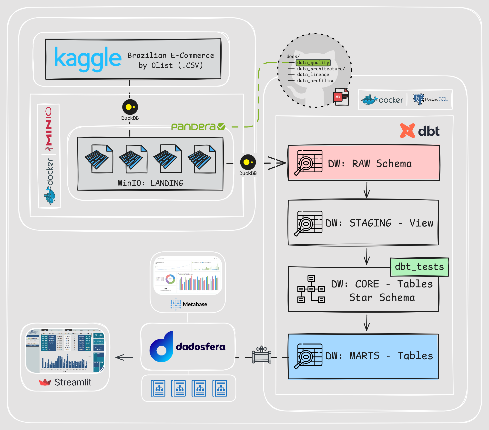
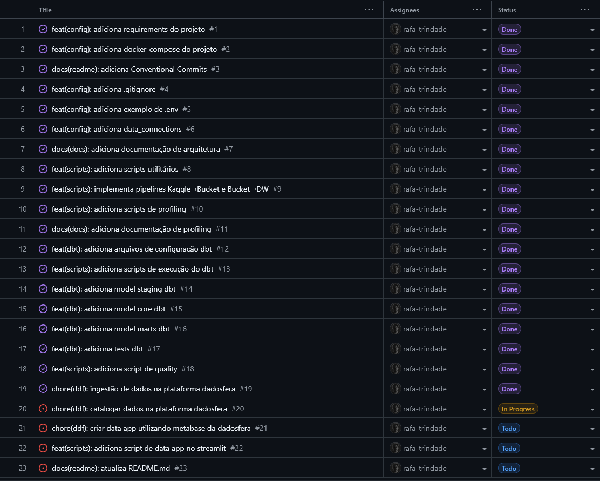
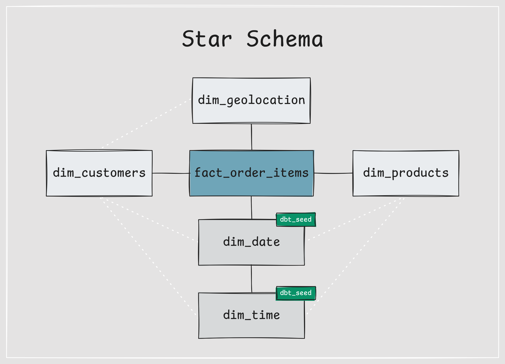
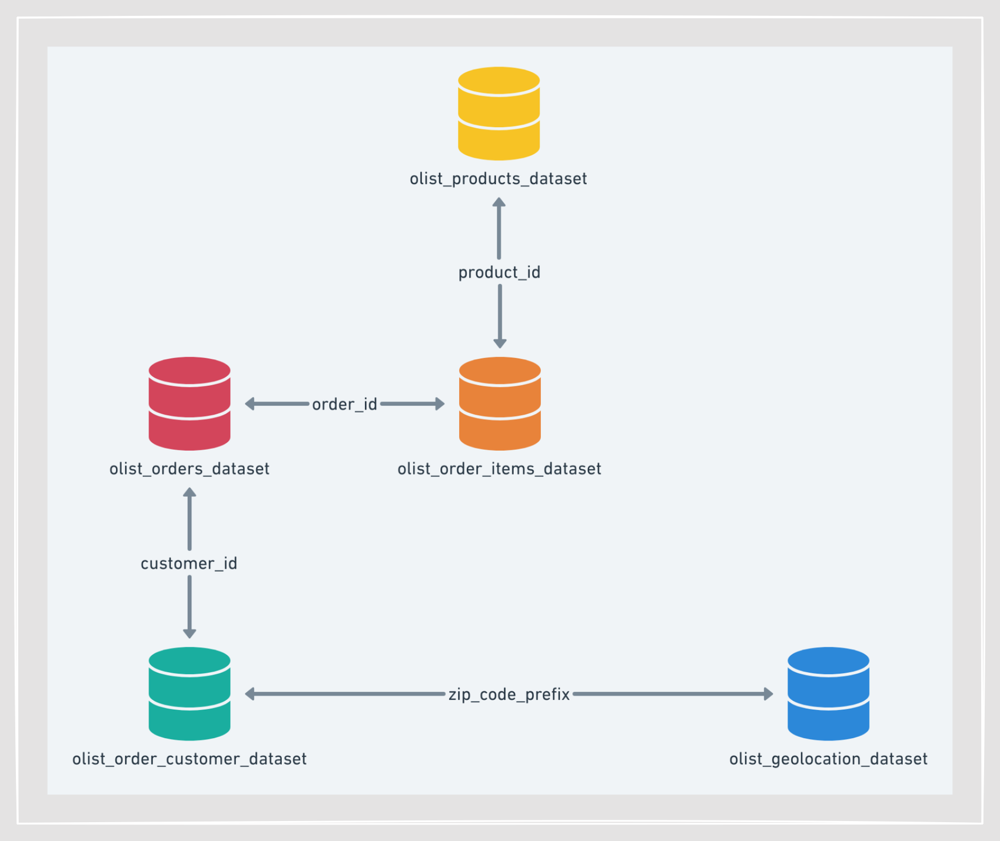
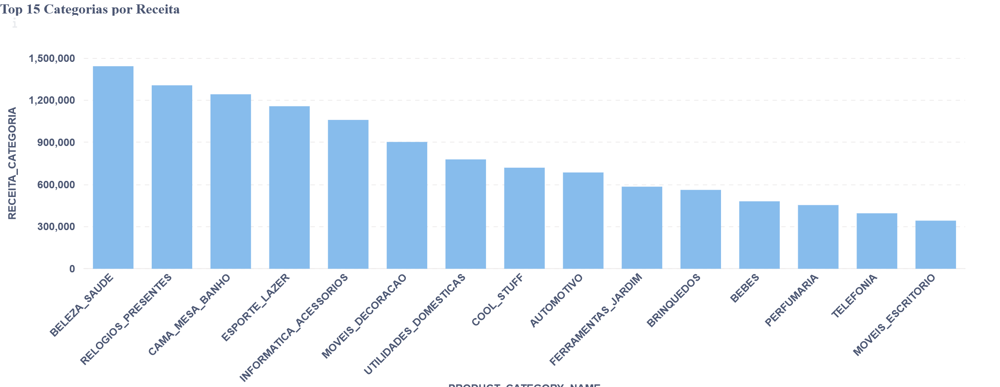
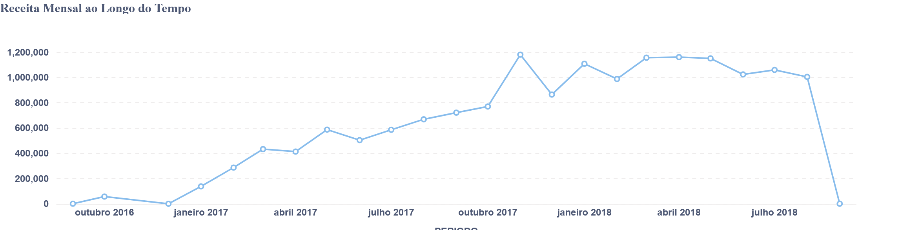
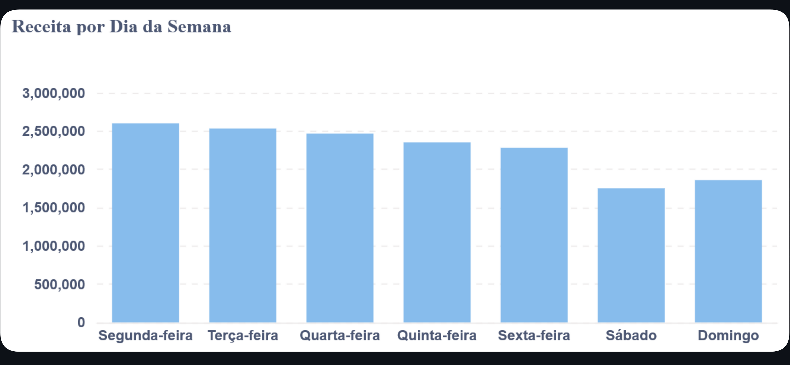
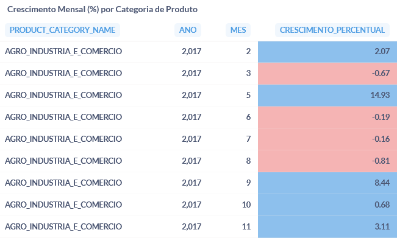

# RAFAEL TRINDADE - DDF_TECH_122025


> **Portfólio:** [https://rafa-trindade.github.io/](https://rafa-trindade.github.io/)<br>
> **LinkedIn:** [https://www.linkedin.com/in/rafatrindade/](https://www.linkedin.com/in/rafatrindade/)


## 📌 Introdução
Este repositório contém a resolução do Case Técnico para a posição Engenheiro de Dados Júnior na **Dadosfera**. O projeto foca em uma empresa de E-commerce, utilizando o dataset brasileiro da Olist (Kaggle) para construir uma plataforma de dados ponta a ponta, integrando engenharia moderna, modelagem dimensional e visualiação de dados.

---

## 🛠️ Arquitetura Geral da Solução
A arquitetura proposta segue padrões modernos de **Lakehouse** + **Data Warehouse Analítico**, combinando **MinIO**, **DuckDB**, **PostgreSQL**, **dbt**, **Pandera** e **Dadosfera**.

### Principais componentes:

- **Fonte de Dados:** Kaggle - Olist (CSV)
- **Data Lake:** MinIO camada Landing (extra: Bronze, Silver, Gold) 
- **Engine de Processamento:** DuckDB
- **Data Warehouse:** PostgreSQL (Docker)
- **Transformações:** dbt
- **Qualidade de Dados:** Pandera + dbt tests
- **Visualizações e Catálogo de Dados:** Dadosfera + Metabase
- **Data App Analítico:** Streamlit



---

### 📚 Mapeamento da Documentação

### 🏗️ Data Architecture
📁 [`docs/data_architecture/`](docs/data_architecture/)

Descreve a arquitetura técnica do projeto em execução:
- Componentes da stack (MinIO, PostgreSQL, DuckDB, Pandera, Docker)
- Papéis e responsabilidades de cada serviço
- Integração entre ingestão, processamento e armazenamento

---

### 🏛️ Data Governance
📁 [`docs/data_governance/`](docs/data_governance/)

Centraliza as políticas e diretrizes do projeto e mapeia como a solução atende,
na prática, aos pilares de **Data Governance**.
- Política de retenção baseada em execuções técnicas (`run_id`)
- Definição de contratos gerais de qualidade de dados
- Estratégias seguras de reprocessamento e rollback
- Suporte nativo à auditoria, observabilidade e controle de custos
- Governança aplicada via código e automação

---

### 🧬 Data Lineage
📁 [`docs/data_lineage/`](docs/data_lineage/)

Documenta a rastreabilidade ponta a ponta dos dados:
- Origem dos dados
- Transformações por camada (Landing → Raw → Staging → Core → Marts → Dadosfera)

---

### 🧱 Data Modeling
📁 [`docs/data_modeling/`](docs/data_modeling/)

- Documenta as decisões de modelagem de dados adotadas no projeto:
- Modelagem OLTP dos dados de origem
- Modelagem OLAP orientada a analytics
- Diagramas e imagens das estruturas de dados

---

### 🔍 Data Observability
📁 [`docs/data_observability/`](docs/data_observability/)

Mapeia como o projeto atende aos pilares de Data Observability:
- Freshness
- Volume
- Schema
- Distribution
- Lineage
- Quality
- Reliability e Reprocessamento

A observabilidade emerge como resultado das decisões de arquitetura e governança.

---

### 📊 Data Profiling
📁 [`docs/data_profiling/`](docs/data_profiling/)

Apresenta análises exploratórias e estatísticas dos dados:
- Volume por camada
- Cardinalidade
- Distribuição de valores
- Percentual de nulos

Utilizado como base para qualidade e observabilidade.

---

# 📑 Itens do Case

## Item 0 - Agilidade e Planejamento

### Metodologia:

O planejamento do projeto foi realizado seguindo boas práticas do PMBOK, combinado com metodologias ágeis.

**Gestão:** Quadro Kanban para controle de tarefas, entregas técnicas e milestones do projeto.




## Item 1 - Base de Dados
**Dataset:** Brazilian E-Commerce Dataset by Olist (Kaggle).

**Justificativa:** 
- Dataset real, amplamente utilizado em projetos analíticos
- Domínio aderente ao cenário de e-commerce
- Volume superior a 100.000 registros
- Contém dados transacionais e descritivos

**Principais tabelas:**
- `olist_orders_dataset`
- `olist_order_items_dataset`
- `olist_products_dataset`
- `olist_customers_dataset`
- `olist_geolocation_dataset`


## Item 2 e 3 - Integrar e Explorar (Dadosfera)

### Estratégia de Ingestão:

A ingestão foi dividida em etapas claras:

**Extração Kaggle → MinIO (Landing)**

- Scripts em Python
- Versionamento por `run_id`
- Dados armazenados em formato parquet
- Verificação de Qualidade com Pandera

**Carga Analítica no Data Warehouse**

- PostgreSQL utilizado como Data Warehouse analítico
- Transformações realizadas com dbt
- Construção do Star Schema (Kimball) diretamente no DW
- Aplicação de testes de qualidade (dbt tests)
- Microtransformações simuladas no contexto analítico
- Motor de processamento na camada de ingestão: DuckDB

**Lakehouse: Landing → Bronze / Silver / Gold (Arquitetura Bônus)**

- Organização incremental
- Padronização de schemas
- Preparação para consumo por modelos de ML

**Carga e catalogação dos dados utilizando o módulo de Coleta da Dadosfera.**

- Módulo de Coleta da Dadosfera
- Execução a partir de VPS dedicada
- PostgreSQL em container com SSL habilitado

A **carga** foi realizada a partir de uma VPS dedicada, configurada para permitir integração segura com a plataforma.

A **catalogação dos dados** foi realizada diretamente na plataforma Dadosfera, onde os ativos ingeridos foram registrados, descritos e organizados, possibilitando sua exploração, governança e reutilização.

**Ativo na Dadosfera:** [[PIPELINE](https://app.dadosfera.ai/pt-BR/collect/pipelines/fb3dc75a-11f8-4c61-99c4-e804871d166d)]  [[LINK PARA O DATASET CATALOGADO](https://app.dadosfera.ai/pt-BR/catalog/data-assets?pipeline_id=fb3dc75a-11f8-4c61-99c4-e804871d166d&pipeline_name=RAFAEL%20TRINDADE%20-%20DDF_TECH_122025)]


## Item 4 - Data Quality

### Abordagem:

A qualidade dos dados foi tratada desde o início do pipeline.

### Ferramentas Utilizadas:

- **Pandera (Python)** - validação de schemas
- **dbt tests** - testes analíticos

### Entregável:

📁 [`reports/pandera/landing/`](reports/pandera/landing/)<br>
📁 [`reports/dbt/staging/`](reports/dbt/staging/)<br>
📁 [`reports/dbt/core/`](reports/dbt/core/)<br>
📁 [`reports/dbt/marts/`](reports/dbt/marts/)


## Item 6 - Modelagem de Dados

Modelagem dimensional seguindo os princípios de Ralph Kimball.

**Esquema:** Star Schema (Tabelas Fato e Dimensão).<br>
**Justificativa:** Otimização para consultas analíticas e performance no BI.

### Estrutura Final:

**Fato:**

- `fact_order_items`

**Dimensões:**

- `dim_customers`
- `dim_products`
- `dim_geolocation`
- `dim_date` *(dbt_seed)*
- `dim_time` *(dbt_seed)*

### `modelo_olap`



### origem: `modelo_oltp`



---

## Item 7 - Analisar (Visualização)

### Acesso ao módulo de Visualização:

Foi utilizado o módulo **Visualização** da Dadosfera, acessado com as **mesmas credenciais do ambiente**, onde os datasets são identificados por meio de um **ID técnico da tabela**.

Exemplo de identificação do dataset na Dadosfera:
- **Database:** `DADOSFERA_PRD_TREINAMENTOS`
- **Schema:** `PUBLIC`
- **Tabela (ID):** `TB__9C6HQS__DW_MARTS__MART_*`

---

### Organização:

Foi criada uma **Coleção** no Metabase seguindo o padrão solicitado:

```text
Rafael Trindade - 122025
```

Dentro dessa coleção foram salvas todas as **queries SQL** e **visualizações** desenvolvidas neste item.

---

### Visualizações Criadas:
Foram criadas **5 perguntas (queries)** utilizando **5 tipos diferentes de visualização**, conforme solicitado:

1. **Top 15 Categorias por Receita**  
   Tipo: Gráfico de Barras  
   Análise do mix de produtos e concentração de receita.

2. **Receita Mensal ao Longo do Tempo**  
   Tipo: Gráfico de Linha  
   Análise de tendência e sazonalidade mensal.

3. **Receita Diária ao Longo do Tempo**  
   Tipo: Gráfico de Linha (série temporal diária)  
   Identificação de picos, quedas e variações diárias.

4. **Receita por Dia da Semana**  
   Tipo: Gráfico de Barras  
   Análise de padrões de consumo ao longo da semana.

5. **Crescimento Mensal (%) por Categoria de Produto**  
   Tipo: Tabela Analítica com Formatação Condicional (Heatmap Analítico)  
   Análise da dinâmica de crescimento percentual por categoria ao longo do tempo, utilizando cores divergentes para facilitar a comparação visual entre períodos e categorias.

Cada visualização teve sua **query SQL salva** e o **print do resultado** anexado a este documento como evidência da execução.

---

### 🔗 Acesso ao Dashboard:

O dashboard consolidando todas as visualizações criadas neste item está disponível no módulo de Visualização da Dadosfera e pode ser acessado por meio do link abaixo:

👉 [[DASHBOARD METABASE DADOSFERA](https://metabase-treinamentos.dadosfera.ai/dashboard/229-rafael-trindade-122025-dashboard)]

---

### 📊 Visualizações e Análises Criadas:

A seguir estão as visualizações desenvolvidas no módulo de **Visualização da Dadosfera**, com foco em análise de categorias e séries temporais, utilizando os dados do Data Mart.

### 1️⃣ Top 15 Categorias por Receita Total

**Pergunta:**  
Quais são as categorias de produtos que mais geram receita no período analisado?

**Descrição:**  
Esta visualização identifica as categorias com maior contribuição de receita total, permitindo compreender onde está concentrado o faturamento do negócio.

**Query SQL**
```sql
SELECT
    PRODUCT_CATEGORY_NAME,
    SUM(RECEITA_CATEGORIA) AS RECEITA_CATEGORIA
FROM "DADOSFERA_PRD_TREINAMENTOS"."PUBLIC"."TB__9C6HQS__DW_MARTS__MART_PRODUCT_CATEGORY_PERFORMANCE"
GROUP BY PRODUCT_CATEGORY_NAME
ORDER BY RECEITA_CATEGORIA DESC
LIMIT 15;
```


---

### 2️⃣ Receita Mensal ao Longo do Tempo

**Pergunta:**  
Como a receita evolui mês a mês ao longo do tempo?

**Descrição:**  
Análise de série temporal que mostra o comportamento da receita mensal, possibilitando identificar tendências, sazonalidades e padrões de crescimento.

**Query SQL**
```sql
SELECT
    TO_DATE(ANO || '-' || LPAD(MES, 2, '0') || '-01') AS PERIODO,
    SUM(RECEITA_MENSAL) AS RECEITA_MENSAL
FROM "DADOSFERA_PRD_TREINAMENTOS"."PUBLIC"."TB__9C6HQS__DW_MARTS__MART_SALES_MONTHLY"
GROUP BY PERIODO
ORDER BY PERIODO;
```


---

### 3️⃣ Receita Diária

**Pergunta:**  
Como a receita se comporta diariamente ao longo do período analisado?

**Descrição:**  
Visualização que detalha a variação diária da receita, útil para identificar picos, quedas pontuais e padrões operacionais no curto prazo.

**Query SQL**
```sql
SELECT
    DATA,
    RECEITA_DIARIA
FROM "DADOSFERA_PRD_TREINAMENTOS"."PUBLIC"."TB__9C6HQS__DW_MARTS__MART_SALES_DAILY"
ORDER BY DATA;
```


---

### 4️⃣ Receita por Dia da Semana

**Pergunta:**  
Quais dias da semana concentram maior volume de receita?

**Descrição:**  
Análise agregada por dia da semana, permitindo identificar comportamentos de consumo recorrentes e apoiar decisões operacionais e comerciais.

**Query SQL**
```sql
SELECT
    NOME_DIA_SEMANA,
    RECEITA_TOTAL,
    CASE NOME_DIA_SEMANA
        WHEN 'Segunda-feira' THEN 1
        WHEN 'Terça-feira'   THEN 2
        WHEN 'Quarta-feira'  THEN 3
        WHEN 'Quinta-feira'  THEN 4
        WHEN 'Sexta-feira'   THEN 5
        WHEN 'Sábado'        THEN 6
        WHEN 'Domingo'       THEN 7
    END AS ORDEM_DIA
FROM "DADOSFERA_PRD_TREINAMENTOS"."PUBLIC"."TB__9C6HQS__DW_MARTS__MART_SALES_WEEKDA"
ORDER BY ORDEM_DIA;

```


---

### 5️⃣ Crescimento Percentual Mensal por Categoria

**Pergunta:**  
Quais categorias apresentam crescimento de percentual ao longo do tempo?

**Descrição:**  
Tabela analítica com formatação condicional que representa visualmente o crescimento percentual mensal das categorias ao longo do tempo, permitindo rápida identificação de variações positivas e negativas entre períodos e categorias.

**Query SQL**
```sql
SELECT
    PRODUCT_CATEGORY_NAME,
    ANO,
    MES,
    CRESCIMENTO_PERCENTUAL
FROM "DADOSFERA_PRD_TREINAMENTOS"."PUBLIC"."TB__9C6HQS__DW_MARTS__MART_CATEGORY_GROWTH_MONTHLY"
WHERE CRESCIMENTO_PERCENTUAL IS NOT NULL
ORDER BY PRODUCT_CATEGORY_NAME, ANO, MES;
```


---

## Item 8 - Pipelines

**Status:** [[PIPELINE](https://app.dadosfera.ai/pt-BR/collect/pipelines/fb3dc75a-11f8-4c61-99c4-e804871d166d)]

### Considerações Técnicas:

Para viabilizar a integração segura entre a infraestrutura de dados e a plataforma da Dadosfera, foi necessária a configuração de um **banco PostgreSQL em container Docker com SSL/TLS habilitado**, executando em uma **VPS dedicada**.

Essa configuração garantiu:
- Comunicação criptografada entre a Dadosfera e o banco de dados
- Segurança no processo de ingestão e processamento dos dados
- Estabilidade e confiabilidade para execução dos pipelines

Os detalhes técnicos dessa configuração encontram-se documentados no guia específico de configuração do PostgreSQL com SSL, disponível em [`docs/configuracoes/postgres_ssl_setup.md`](docs/configuracoes/postgres_ssl_setup.md)

---

## Item 9 - Data App (Streamlit)

Desenvolvimento de um Data App utilizando o Streamlit.
* **URL do App:** [[STREAMLIT VPS](http://54.39.98.107:8501/)]

Desenvolvimento de um Data App interativo com Streamlit, implantado em uma VPS dedicada.

O aplicativo disponibiliza visualizações analíticas das marts construídas, permitindo o acompanhamento centralizado de indicadores de negócio.

A aplicação foi configurada para execução contínua no servidor, com acesso público via navegador.


---

## Item 10 - Apresentação (Pitch Técnico)
Apresentação da solução e demonstração da viabilidade de substituição da arquitetura atual pela Dadosfera.

👉 **[LINK PARA O VÍDEO NO YOUTUBE - NÃO LISTADO]**

